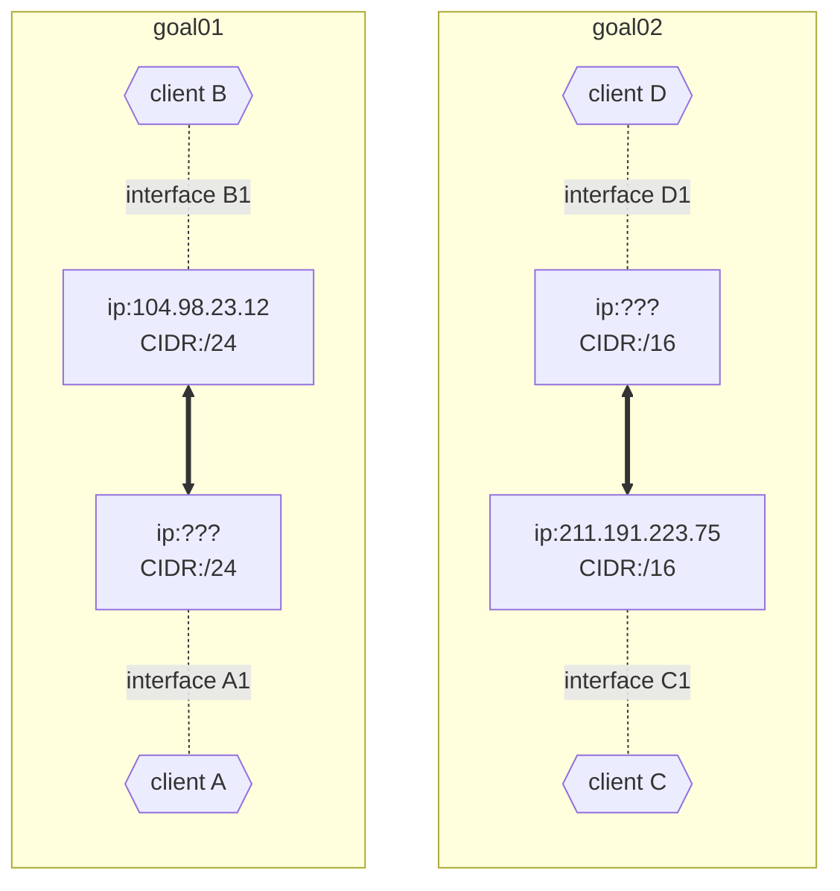
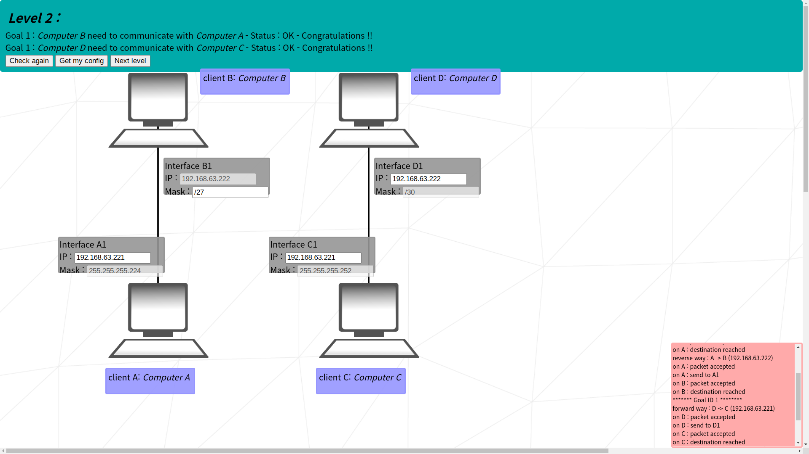
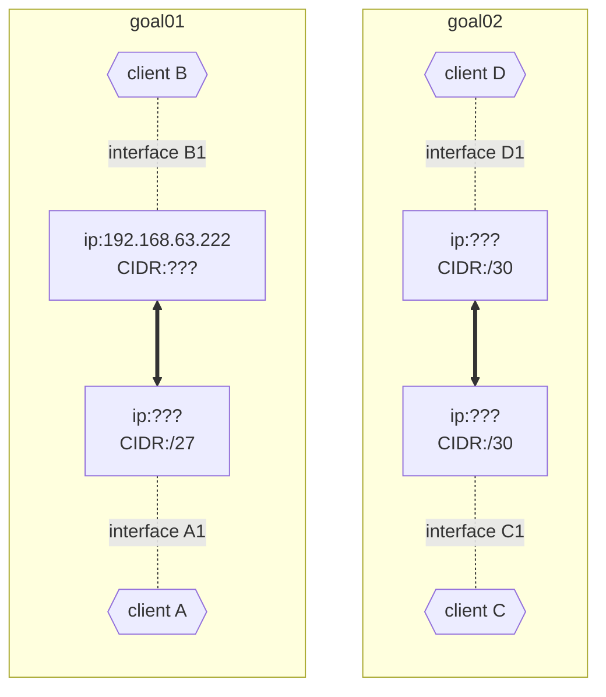

# netpractice

internet protocol or: how i learned to stop worrying and love the router

korean translation comming soon (ish)

## Things to remember

### IPv4

- 0 ~ 255 * 4 = 4 bytes = 32 bits

### Private IPv4 addresses

- can be only used within the same network
- 10.0.0.0/8
- 172.16.0.0/12
- 192.168.0.0./16

### Subnet Masks

- apply AND ops to get the network address
- CIDR notation = `/{number of 1s in binary}`
- first and last of an address range is reserved
  - first: network ID address
  - last: broadcast address
### Interface

- lines connecting internet devices are a lie! (maybe?)
- network is like shouting numbers at each other
- so individual's address must not overlap with others
- interfaces will decide to only listen to numbers within their range
- that range is the subnet mask

### Switch
- distributes packets to local network
- can be ignored in the subject, since it doesn't do much

### Router
- connects multiple **different** network addresses
- so its addresses (and their ranges) must not overlap

### Routing table
- if a packet's destination address is not within local network, the router won't know where to send
- but it could 'toss' the packet to another router, so that router may know where to send it
- if one of the destination in routing table match with packet's, the router will send it to the 'next hop'
- if 'next hop' knows the destination, it will send it to the destination, if not, hop again and again...
- `default` == 0.0.0.0/0, since every ip address would match

## levels

### level 01

    
screenshot

    

#### goal 01
- A and B are on the same network, so their network address must match
- since B's address is 104.98.23.12 and CIDR is /24 -> network address: `104.98.23.0`
- any ip address within `104.98.23.1 ~ 104.98.23.254` are within samw network 'called' `104.98.23.0`
- address of A can be anything within above range
- except B's, because how are you gonna distinguish between same addresses

#### goal 02
- same as goal 01 but CIDR is /16
- so they will listen to any ip address within `211.191.0.1 ~ 211.191.255.254`
- same as goal01

### level 02

    
screenshot

    

#### goal 01
- client A will listen to `
