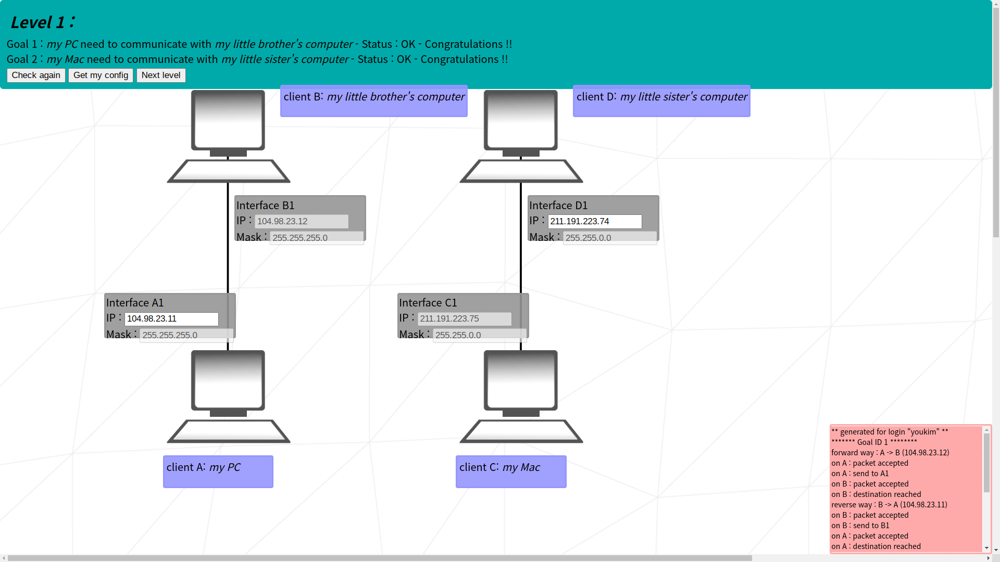
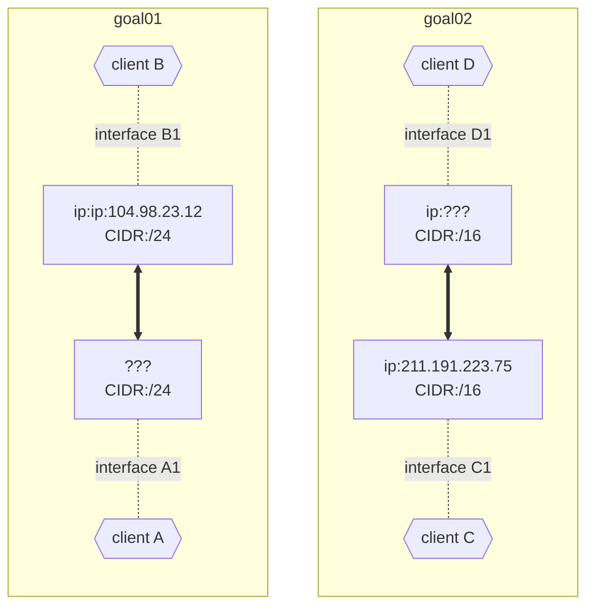

# netpractice

internet protocol or: how i learned to stop worrying and love the router

## Things to remember

### IPv4

- 0 ~ 255 * 4 = 4 bytes = 32 bits

### Subnet Masks

- apply AND ops to get the network address
- CIDR notation = `/{number of 1s in binary}`
- first and last of an address range is reserved
  - first: network ID address
  - last: broadcast address
### Interfaces

- lines connecting internet devices are a lie! (maybe?)
- network is like shouting numbers at each other
- so individual's address must not overlap with others
- interfaces will decide to only listen to numbers within their range
- that range is the subnet mask

## levels

### Level 01

    
image

    

#### situation
- two pairs of computers needs to communicate with each other

#### goal01
- CIDR of both client A and client B is /24
- so they will listen to any ip address within `104.98.23.1 ~ 104.98.23.254`

#### goal02
- CIDR of client D is /16
- so they will listen to any ip address within `211.191.0.1 ~ 211.191.255.254`
