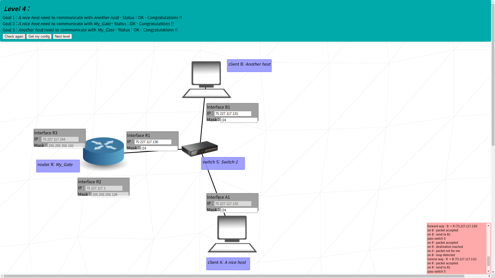

# netpractice

internet protocol or: how i learned to stop worrying and love the router

[references](https://github.com/lpaube/NetPractice)
korean translation comming soon (ish)

## Things to remember

### IPv4

- 0 ~ 255 * 4 = 4 bytes = 32 bits

### Private IPv4 addresses

- can be only used within the same network
- 10.0.0.0/8
- 172.16.0.0/12
- 192.168.0.0./16

### Subnet Masks

- apply AND ops to get the network address
- CIDR notation = `/{number of 1s in binary}`
- first and last of an address range is reserved
  - first: network ID address
  - last: broadcast address

### Interface

- network is like shouting numbers at each other
- so individual's address must not overlap with others
- interfaces will decide to only listen to numbers within their range
- that range is the subnet mask

### Switch
- distributes packets to local network
- can be ignored in the subject, since it doesn't do much

### Router
- connects multiple **different** network addresses
- so its addresses (and their ranges) must not overlap

### Routing table
- if a packet's destination address is not within local network, the router won't know where to send
- but it could 'toss' the packet to another router, so that router may know where to send it
- if one of the destination in routing table match with packet's, the router will send it to the 'next hop'
- if 'next hop' knows the destination, it will send it to the destination, if not, hop again and again...
- `default` == 0.0.0.0/0, since every ip address would match

## levels

### level 01

<!---

-->

#### goal 01
- A and B are on the same network, so their network address must match
- since B's address is 104.98.23.12 and CIDR is `/24` -> network address: `104.98.23.0`
- any ip address within `104.98.23.{1 ~ 254}` are within samw network 'called' `104.98.23.0`
- address of A can be anything within above range
- except B's, because how are you gonna distinguish between same addresses

#### goal 02
- same as goal 01 but CIDR is `/16`
- so they will listen to any ip address within `211.191.{0.1 ~ 255.254}`
- same as goal01

### level 02

<!---

-->

#### goal 01
- client A and B's subnet mask should match -> `/27`
- there can be 8 possible network address with usable range of 30 for `/27`
  - `xxx.xxx.xxx.{0, 32, 64, 96, 128, 160, 192, 224}`
  - since B's last digits are 222 -> `192.168.63.192/27`
- A's address can be within `192.168.63.{193 ~ 221}`

#### goal 02
- same as goal 01 but CIDR is `/30`
- 64 possible network address with usable range of 2 for `/30`
  - `xxx.xxx.xxx.{0, 4, 8 ... 252}`
  - address can be same as goal 01 because these are seperate networks

### level 03

#### goal 01 ~ 03
- same as level 02 but with one more client
- calculated network address and range: [`104.198.197.0/25`](https://www.calculator.net/ip-subnet-calculator.html?cclass=any&csubnet=25&cip=104.198.197.125&ctype=ipv4&printit=0&x=88&y=9)
  - which means usable host ip range: `104.198.197.1 ~ 104.198.197.126`
- just don't make their ip overlap

### level 04

#### goal 01 ~ 03
- since all masks are empty -> `75.227.117.0/24` will be easiest
  - host ip range: `75.227.117.{1 ~ 254}`
