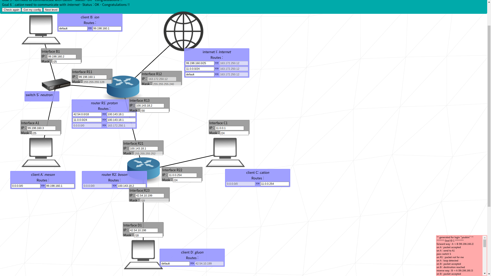

# Advanced

## level 08

### learn to
- split exsisting network address to make more

### goal 01
- C and D needs to comunicate with internet later, so their ip addresses are within fixed range of `170.150.149.0/26`
  - since two networks needs to be within that range and D's CIDR is fixed at `/28`, applying `/28` would cut it in four: `170.150.149.{0, 16, 32, 48}/27`
  - `C <-> R22` and `D <-> R23` could grab one of those four

### goal 02 ~ 03
- R2's routing hop is fixed to `170.150.149.62`, so that would be R13
  - R21's ip should match with R13 to be within same network
- R1's routing hop should point to R21

## level 09

### goal 01
- same as level 04

### goal 02
- R23's ip and CIDR is given (`42.54.10.199`)
- D does not need to communicate to internet, so forget about it
- set IP of D within `42.54.0.0/18`

### goal 03
- `A <-> R11 <-> B`'s on network address `99.198.160.0/25`
- give the address to internet

### goal 04 ~ 05
- `A1 -> R1 -> R21 -> R23 -> D1`
- `D <-> R23`'s on network address `42.54.0.0/18` [(from goal 02)](#goal-02)
  - add this address to R1 so it could send the packet to R2
- goal 05 would be same as 04
### goal 06
- give I and R1 the network address of `C <-> R22`
