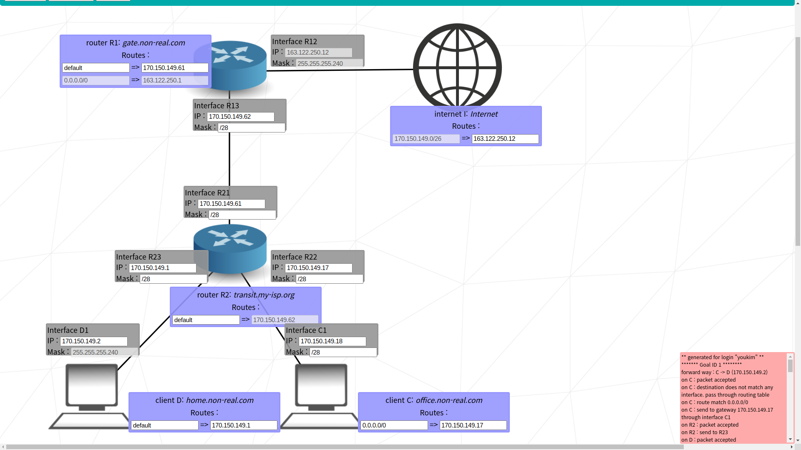

# Advanced

## level 08

### learn to
- split exsisting network address to make more

### goal 01
- C and D needs to comunicate with internet later, so their ip addresses are within fixed range of `170.150.149.0/26`
  - since two networks needs to be within that range and D's CIDR is fixed at `/28`, applying `/28` would cut it in four: `170.150.149.{0, 16, 32, 48}/27`
  - `C <-> R22` and `D <-> R23` could grab one of those four

### goal 02 ~ 03
- R2's routing hop is fixed to `170.150.149.62`, so that would be R13
  - R21's ip should match with R13 to be within same network
- R1's routing hop should point to R21

