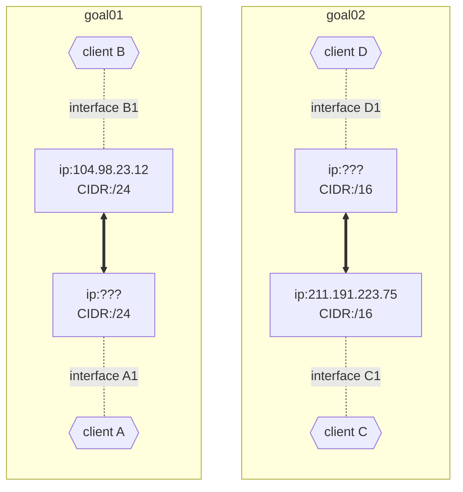
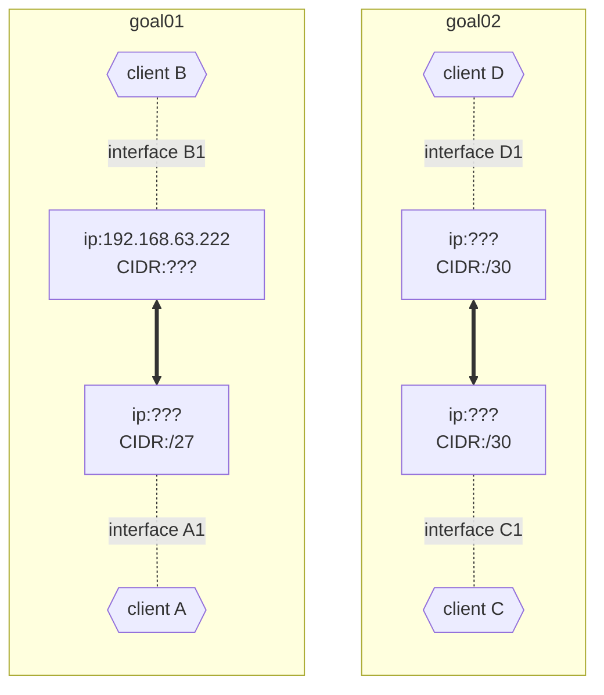

# Basic

## level 01

<!---

-->
### learn to
- make ips distinct in same network
- get network address by applying subnet mask to ip

### goal 01
- A and B are on the same network, so their network address must match
- by applying subnet mask `/24` to B's ip, you get `104.98.23.0/24`
- any ip address within `104.98.23.{1 ~ 254}` are within the same network, `104.98.23.0`
- so ip of A should be within the above range
- except B's (`104.98.23.12`), because how are you gonna distinguish between same addresses

### goal 02
- same as goal 01 but CIDR is `/16`
- so they will listen to any ip address within `211.191.{0.1 ~ 255.254}`
- same as goal01

## level 02

<!---

-->

### goal 01
- client A and B's subnet mask should match -> `/27`
- there can be 8 possible network address with usable range of 30 for `/27`
  - `xxx.xxx.xxx.{0, 32, 64, 96, 128, 160, 192, 224}`
  - since B's last digits are 222 -> `192.168.63.192/27`
- A's address can be within `192.168.63.{193 ~ 221}`

### goal 02
- same as goal 01 but CIDR is `/30`
- 64 possible network address with usable range of 2 for `/30`
  - `xxx.xxx.xxx.{0, 4, 8 ... 252}`
  - address can be same as goal 01 because these are seperate networks

## level 03

### goal 01 ~ 03
- same as level 02 but with one more client
- calculated network address and range: [`104.198.197.0/25`](https://www.calculator.net/ip-subnet-calculator.html?cclass=any&csubnet=25&cip=104.198.197.125&ctype=ipv4&printit=0&x=88&y=9)
  - which means usable host ip range: `104.198.197.1 ~ 104.198.197.126`
- just don't make their ip overlap

## level 04

### goal 01 ~ 03
- since all masks are empty -> `75.227.117.0/24` will be easiest
  - host ip range: `75.227.117.{1 ~ 254}`
- just don't make them overlap
- there will be more after having other interfaces...
