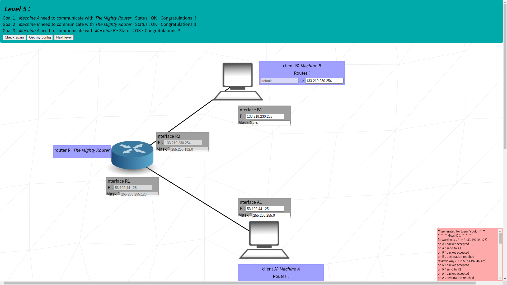

# Intermediate

## level 05

### learn to
- use multiple different network addresses
- use routing table

### goal 01

- A and R1 must be in the same network address to communicate
- calculated network address from R1: `53.192.44.0/25`

### goal 02
- same as goal 01
- note that network address of A1-R1 and B1-R2 is different

### goal 03
- for A and B to communicate, A must send packet to B
- A knows the destination is `133.219.230.253`, but does not have (or 'know') direct connection to it
- therefore it would send it to others who might have the connection
- first A searches for routing table
  - `133.219.230.253` falls within range of `0.0.0.0/0`, which means every single IPv4 address
- then it should send its packet to interface R1, since it has the connection
- when R1 gets the packet, R has the connecton to B, therefore would send the packet to B
- after getting packet from A, B must also send back packets to A to ensure it has received the packet
- it's the same as A -> B
