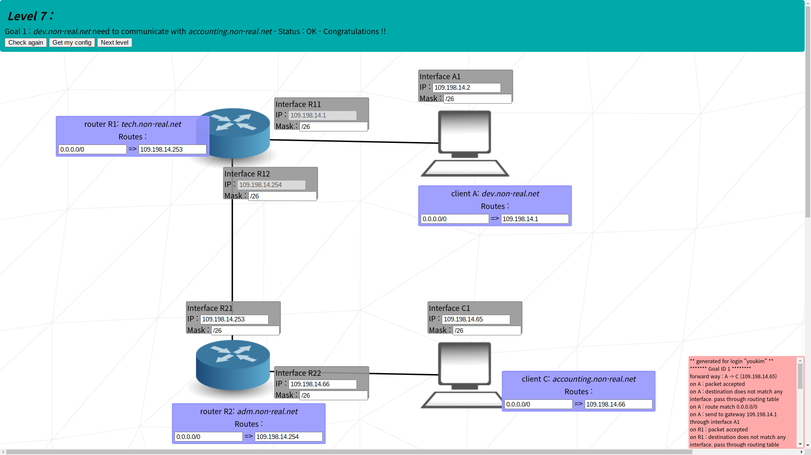

# Intermediate

## level 05

### learn to
- use multiple different network addresses
- use routing table

### goal 01

- A and R1 must be in the same network address to communicate
- calculated network address from R1: `53.192.44.0/25`

### goal 02
- same as goal 01
- note that network address of A1-R1 and B1-R2 is different

### goal 03
#### A -> B
- for A and B to communicate, A must send packet to B
- A knows the destination is `133.219.230.253`, but does not have (or 'know') direct connection to it
- therefore it would send it to others who might have the connection
- first A searches for routing table
  - `133.219.230.253` falls within range of `0.0.0.0/0`, which means every single IPv4 address
- then it should send its packet to interface R1, since it has the connection
- when R1 gets the packet, R has the connecton to B, therefore would send the packet to B
#### B -> A
- after getting packet from A, B must also send back packets to A to ensure it has received the packet
- it's the same as A -> B

## level 06

### learn to
- send to and from internet using routing table
- not use private ip address

### goal 01

#### A -> I
- A needs to send packet (destination `8.8.8.8`) to in internet but does not know how
- ideal path would be `A1 -> S -> R1 -> R2 -> I`
- A should send the packet to R1 using its routing table
- R does not know where the packet would go either, so it should send it to R2
  - then the other end from R2 would handle the packet

#### I -> A
- I needs to send return packet to A but does not know how
- ideal path would be `I -> R2 -> R1 -> S -> A1`
- provide A1's network address so internet can toss the packet to R2
  - can't just enter `default` to routing table
  - it might have to be with that internet-router relationship is 1-many
- no more need to provide network address from here since R knows A

## level 07

### learn to
- keep multiple network addresses from overlapping
### goal 01

- network addresses must not overlap with each other
  - there are 3 of them, `A <-> R1`, `R1 <-> R2`, `C <-> R2`

#### R11 <-> A1
- R11 and R12's network ips both share `109.198.14`
  - so CIDR of can't be `/24` or both will overlap
  - for convenience, all networks would have `/26` and share `109.198.14`
  - then viable network addresses are: [`109.108.14.{0, 64, 128, 192}`](https://www.calculator.net/ip-subnet-calculator.html?cclass=any&csubnet=26&cip=109.198.14.0&ctype=ipv4&printit=0&x=94&y=12)
  - so for A1 and R11, `109.108.14.0/26`

#### R12 <-> R21
- since R12's last digits are 254, network address must be `109.198.14.192/26`

### R122 <-> C1
- choose between `109.108.14.{64, 128}` since others are taken
